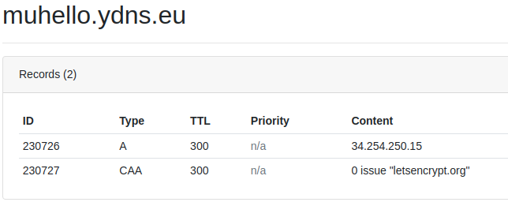

# Example python server with dynamic DNS and automatic TLS

You will need:

- a [ydns](https://ydns.io/) account
- a docker server
- git

## Steps

1. Create an entry in your ydns account, and add a CAA record with `0 issue "letsencrypt.org"` 
2. copy `ydnspass.env.sample` in `ydnspass.env` and enter your ydns API credentials
3. Put your hostnames in `ydns.env`
4. ediit Caddifile to point to the right services
5. start the whole thing with `docker compose up -d`

## Update the service

```bash
docker compose create --build hello
```
